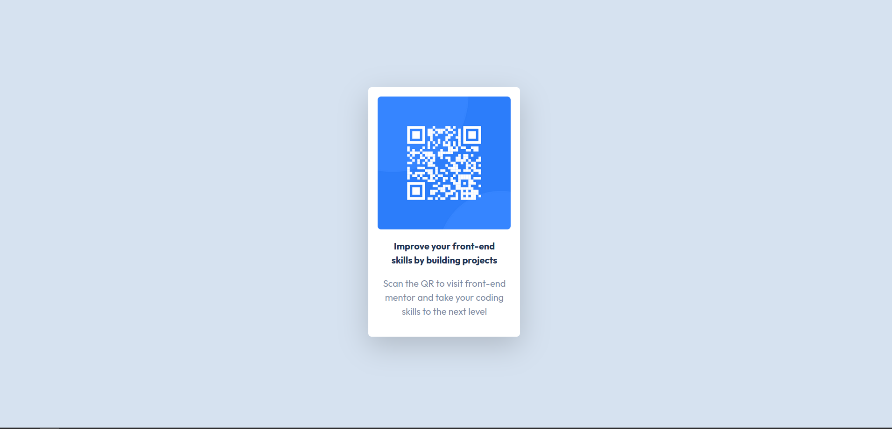

# Frontend Mentor - QR code component solution

This is a solution to the [QR code component challenge on Frontend Mentor](https://www.frontendmentor.io/challenges/qr-code-component-iux_sIO_H). Frontend Mentor challenges help you improve your coding skills by building realistic projects. 

## Table of contents

- [Overview](#overview)
  - [Screenshot](#screenshot)
  - [Links](#links)
  - [Built with](#built-with)
  - [What I learned](#what-i-learned)
- [Author](#author)

## Overview

I´ll be adding the the screenshots on the project files, feel free to use it however you want.

### Screenshot

### Links

- Solution URL: [Github - QR Component](https://www.github.com/LissaiDev/qr-component-frontendMentor)

### Built with

- Semantic HTML5 markup
- CSS custom properties
- Flexbox
- CSS Grid
- Bootstrap 5

**Note: These are just examples. Delete this note and replace the list above with your own choices**

### What I learned

It was a good project to recap some concents and go back to the basics.

## Author

- Website - [lissaidev](https://www.lissaidev.github.io)
- Frontend Mentor - [LissaiDev](https://www.frontendmentor.io/profile/lissaidev)

